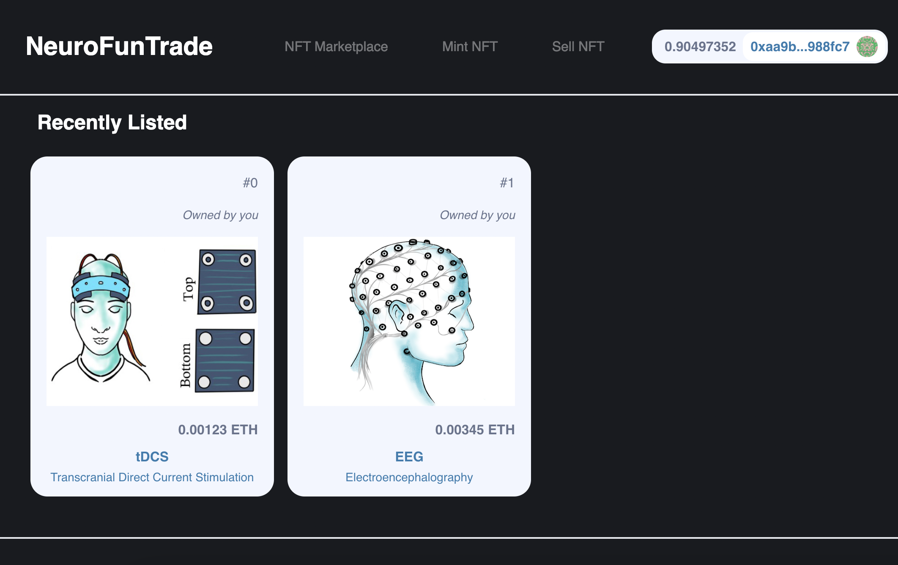
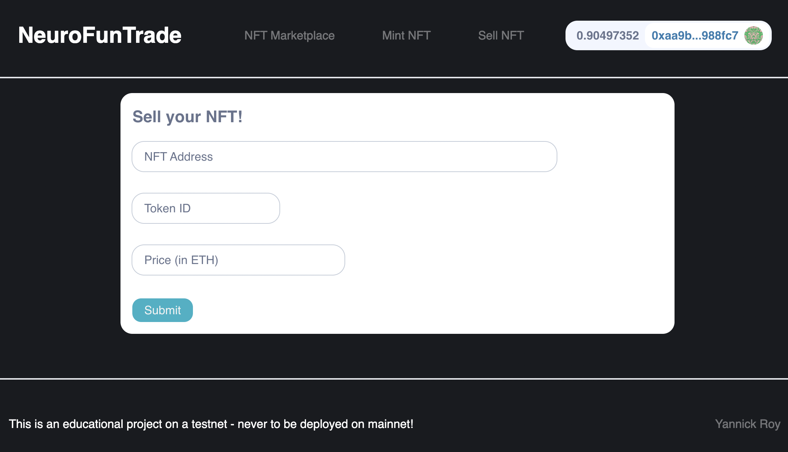
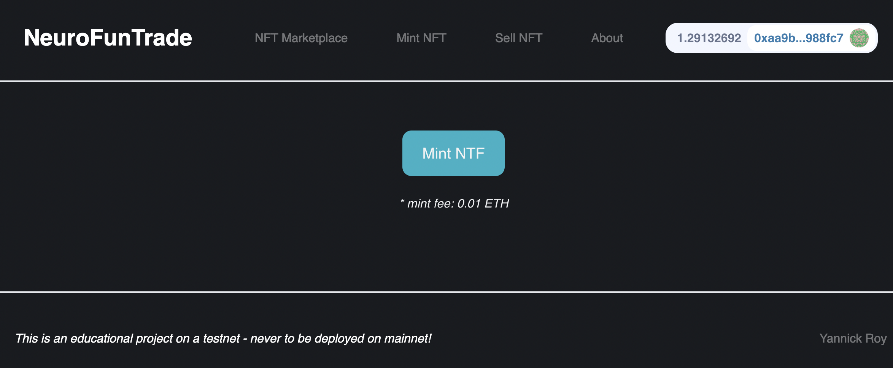
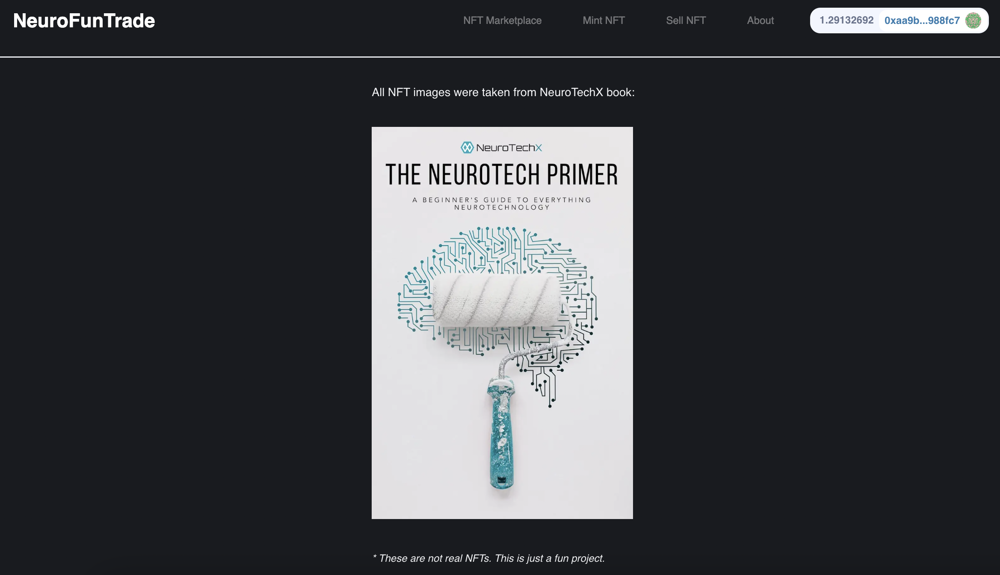

# NeuroFunTrade - NFT Marketplace

This is a pet (fun) project allowing to mint neuro-related NFTs and list/sell/buy them on an NFT Marketplace Goerli Testnet.

_This is a test project, not a real project. No real NFTs, no real value. The value resides in the learning! And that's worth more than a few NFTs. (well, maybe not during the peak of a bull run...)_

Smart Contracts deployed on Goerli and Website deployed via Netlify: [https://neuronft.netlify.app/sell-nft](https://neuronft.netlify.app/sell-nft)

---

## Tech Stack

- Solidity
- Hardhat
- ReactJS, NextJS (+ Web3UIKit, TailwindCSS)
- Pinata
- The Graph
- Moralis
- Open Zeppelin
- Apollo Client
- Chainlink VRF
- Netlify (Web App Deployed - linked with this Github repo)

---

## Smart Contract

2 Smart Contracts (+1 mock) deployed on Goerli (Ethereum Testnet):

0. [Mock] VRF Coordinator (for local tests)
1. NFT (IERC721)
2. NFT Marketplace

---

## NFT Marketplace Website

Main Page - Listing Available NTFs.

Sell Page - Allows the users to sell (i.e. list) their NFTs.

Mint Page - Allows the users to mint new NFTs.

About Page

---

_This project was inspired by the [32 hours FreeCodeCamp course by Patrick Collins](https://www.youtube.com/watch?v=gyMwXuJrbJQ&ab_channel=freeCodeCamp.org) on Full Stack Blockchain using JS._

_Thanks Pat for such an amazing course! I've learned so much and had so much fun coding along!_
